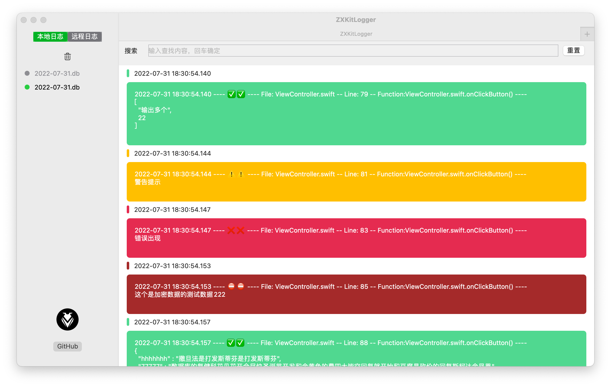

# DDLoggerSwift

   

### [中文文档](https://dongge.org/blog/1305.html)

**DDLoggerSwift** is an iOS library that displays log output as a floating overlay on the screen. It allows easy logging and supports log file sharing and uploading, making it convenient for debugging on a real device without an Xcode connection. Users can share and filter logs effortlessly.  

This project uses **SQLite** for efficient log storage while ensuring insertion order. It does not affect UI performance or interactions, ensuring high runtime efficiency.Automatically converts `Array` and `Dictionary` into JSON strings for display.


|Preview GIF picture|Xcode debug GIF|
|----|----|
|||


## **1. Installation**  

You can install **DDLoggerSwift** using **CocoaPods** or manually by downloading the source files and adding them to your project.  

### **1.1 CocoaPods Installation**  
Add the following line to your `Podfile` and run `pod install`:  
```ruby
pod 'DDLoggerSwift'
```

### **1.2 Manual Installation**  
Drag and drop the files from the `pod` folder into your project.  

---

## **2. Usage**  

### **1. Import the Framework**  
```swift
import DDLoggerSwift
```

### **2. Show the Floating Log Window**  
```swift
DDLoggerSwift.show()
```

### **3. Log Output**  

There are **five types of log outputs**, each with different font colors.  

```swift
printDebug(log)   // Debug output, only visible in Xcode, not stored in the log database.

printLog(log)     // Logs displayed in green.

printWarn(log)    // Logs displayed in yellow.

printError(log)   // Logs displayed in red.

printPrivacy(log) // Outputs encrypted data. Encryption details can be found in the encryption documentation.
```

### **4. Log Output Format**  

```
✅ [2025-03-19T03:11:59Z] [INFO] File: TalkViewModel.swift | Line: 730 | Function: _bindRequest() |
---------------------------------
Log message

⚠️ [2025-03-19T03:11:59Z] [WARN] File: TalkViewModel.swift | Line: 730 | Function: _bindRequest() |
---------------------------------
Warning message

❌ [2025-03-19T03:11:59Z] [ERROR] File: TalkViewModel.swift | Line: 730 | Function: _bindRequest() |
---------------------------------
Error message

⛔️ [2025-03-19T03:11:59Z] [PRIVACY] File: TalkViewModel.swift | Line: 730 | Function: _bindRequest() |
---------------------------------
AAuKjIm5hC2jiPqz7OKHAngWspeACyWZufDguqdOcugituhWV8jnbr/6SHYoK0/9

💜 [2025-03-19T03:11:59Z] [DEBUG] File: TalkViewModel.swift | Line: 730 | Function: _bindRequest() |
---------------------------------
Test output, not stored in the database by default.
```

## III. Advanced Usage

For advanced features such as file encryption, custom formats, file retrieval, and sharing, please refer to the wiki for a complete list and detailed instructions. 

**[Wiki](https://github.com/DamonHu/DDLoggerSwift/wiki)**


## IV. Log viewing client

This library stores log information using SQLite. You can use any generic SQLite viewer or the [DDLoggerClient](https://github.com/DamonHu/DDLoggerClient) client to view the SQLite files exported by DDLoggerSwift.

The client is developed using SwiftUI and is specifically designed to parse logs from DDLoggerSwift, making log viewing more convenient.





## License

The project is based on the MIT License
