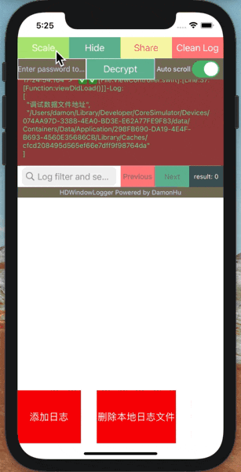
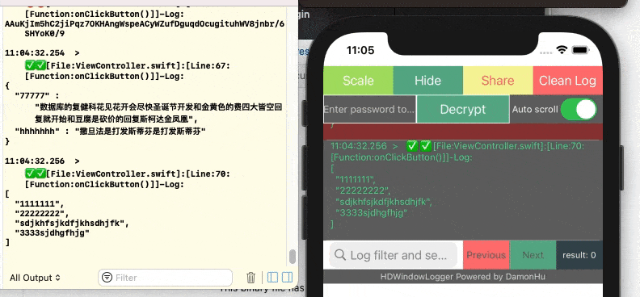
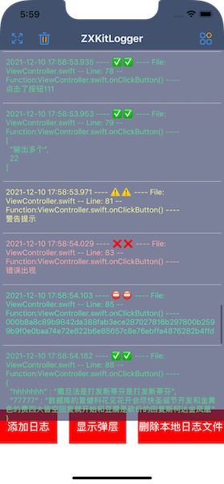
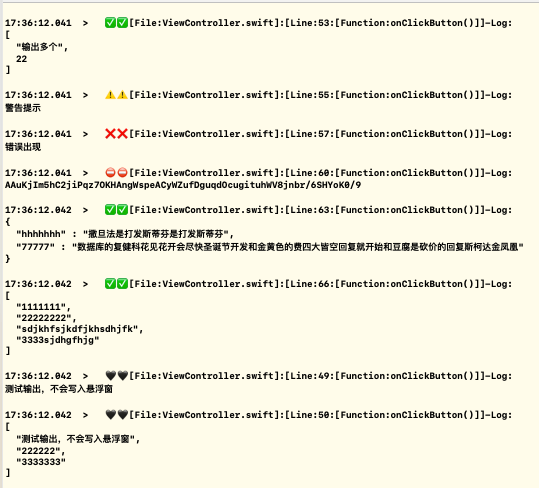
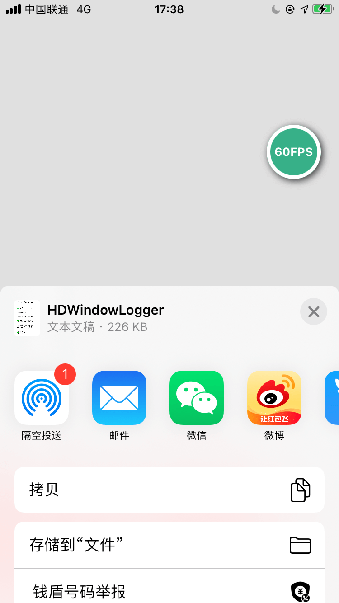
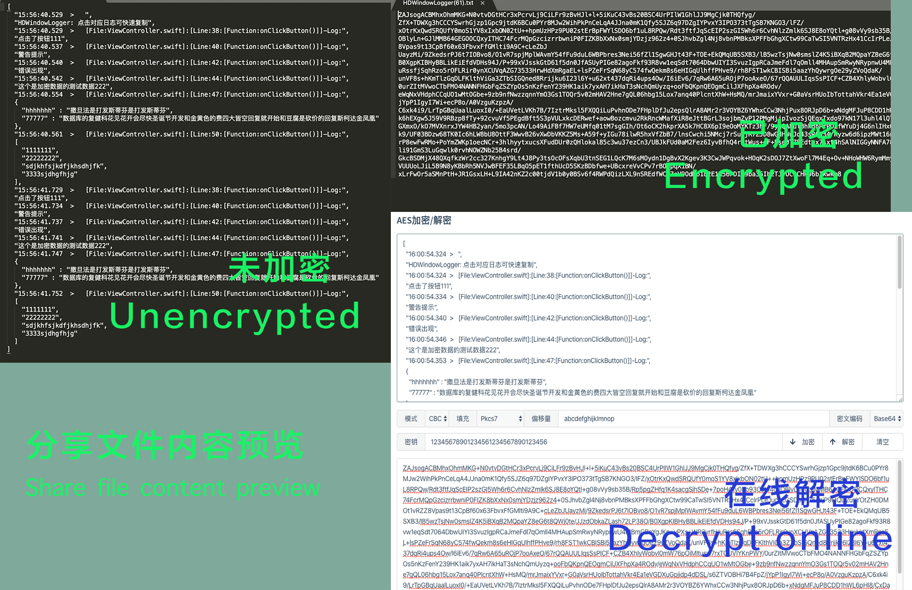
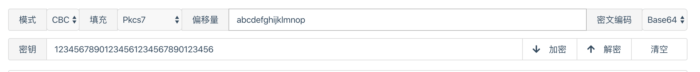

# ZXKitLogger

[中文文档](./README_zh.md)

iOS端将输出日志log悬浮显示在屏幕上，可以生成日志文件分享，便于在真机没有连接xcode的情况下调试信息。可以分享、筛选log等操作。使用SQLite存储日志信息，支持系统分享和屏幕FPS显示

The iOS terminal will display the output log suspended on the screen, which can generate log file sharing, and debug information when the real machine is not connected to Xcode. You can share, filter logs and other operations. Use SQLite to store log information, support system sharing and screen FPS display


## Introduction to English


Project address: [https://github.com/DamonHu/HDWindowLoggerSwift](https://github.com/DamonHu/HDWindowLoggerSwift)

In addition to displaying on the screen, you can set whether to automatically scroll the log for debugging, or you can share the output log to WeChat, twitter, etc. for offline viewing. At the same time, you can search for output content, Sensitive content can be encrypted with a password, and shared files are also encrypted, and can be decrypted online with a password.

The project uses' SQLite 'efficient storage, only records data during the background operation, and not affect the performance of the interface. The foreground operation is efficient. It basically outputs logs synchronously with Xcode, and you can view the GIF chart of the comparison with Xcode log output

|Preview GIF picture|Xcode debug GIF|
|----|----|
|||


|mobile preview|Xcode preview|share & FPS|
|----|----|----|
||||



## I. Installation

You can choose to install using cocoaPod, or you can download the source file directly into the project.

### 1.1, cocoaPod installation

```
pod 'ZXKitLogger'
```

#### 1.1.1, wcdb compatible

If you have integrated Tencent's [Tencent / wcdb] (https://github.com/Tencent/wcdb), the system functions of `sqlite` have been modified and optimized, which will cause the same error as the function name. You can use the wcdb version

```
Pod'ZXKitCore/wcdb'
```


### 1.2, file installation

You can drag the files in the `pod` folder into the project under the project.

## II. Use

### 1、Import header file

```
Import ZXKitLogger
```


### 2、 display the floating window

```
ZXKitLogger.show()
```

### 3 、 Print log content

The font colors of the three output methods are different, and the corresponding types of printLog are different.

```
ZXDebugLog(log)	//the log will not be written to the window, only output in xcode

ZXNormalLog (log) // Log's textColor is green

ZXWarnLog (log) // log's textColor is yellow

ZXErrorLog (log) // Log's textColor is red

ZXPrivacyLog (log) // Output of encrypted data, the specific encryption method is described in the following encryption
```

Output format

```
13: 45: 00.153> [
  "1111111",
  "22222222",
  "sdjkhfsjkdfjkhsdhjfk",
  "3333sjdhgfhjg"
]
```

## III. more settings

### 1、Set whether to output all information

```
ZXKitLogger.isFullLogOut = true
```

If set to output all debugging information, the output format is as follows, including the output file, the number of lines called, and the function called

```
13: 51: 38.498> [File: ViewController.swift]: [Line: 41: [Function: onClickButton ()]]-Log:
[
  "1111111",
  "22222222",
  "sdjkhfsjkdfjkhsdhjfk",
  "3333sjdhgfhjg"
]
```

### 2、 Whether to output content synchronously in the debug bar at the bottom of xcode

```
ZXKitLogger.isSyncConsole = true
```

### 3、Separate log folder for different users

```
ZXKitLogger.userID = "1001"
```

### 4、Clear the log

```
ZXKitLogger.cleanLog()
```

### 5、close the entire log window

```
ZXKitLogger.close()
```

### 6、only hide the log output window

```
ZXKitLogger.hide()
```

### 7、set the log maximum number of records,  0 is not limited, default value is 100

```
ZXKitLogger.maxDisplayCount = 100
```
### 8、 delete the local LogFile

```
ZXKitLogger.deleteLogFile()
```

### 9、 The validity period of the local log file (days), the local log beyond the validity period will be deleted, 0 is no validity period, the default is 7 days

```
ZXKitLogger.logExpiryDay = 0
```

### 10、Get the array of logs. You can specify the date

```
//today
ZXKitLogger.getAllLog()

//Special date
ZXKitLogger.getAllLog(date: Date(timeIntervalSinceNow: 1000))
```

If you want to get all the log files, you can get the folder where the log is stored, return a URL result, and then traverse to process it yourself

```
ZXKitLogger.getDBFolder()
```

for example

```
let dbFolder = ZXKitLogger.getDBFolder()
        
if let enumer = FileManager.default.enumerator(atPath: dbFolder.path) {
    while let file = enumer.nextObject() {
       if let file: String = file as? String {
            if file.hasSuffix(".db") {
	            //Get the specific log file log
                let logFilePath = dbFolder.appendingPathComponent(file, isDirectory: false)              
            }
        }
    }
}
```

### LogContent protocol

If you want to customize the output content, you can integrate and use this type of `LogContent` protocol. For example, you can print the `URL` type to output only its` path`. You can directly set the returned `logStringValue`.

```
extension URL: LogContent {
    public var logStringValue: String {
        return self.path
    }
}
```

### 1.2, support ZXKit quick start

This tool supports `ZXKit` quick start, If you want to use this function, you can add the following pod command

```
pod'ZXKitCore/zxkit'
```

Then register to 'zxkit'

```
ZXKitLogger.registZXKit()
```

## IV. sensitive information output encryption and decryption

If there is sensitive information that you don't want users to see when debugging, you can set encryption in two simple steps

```
// 1. Set the encryption password,  32 characters
ZXKitLogger.privacyLogPassword = "12345678901234561234567890123456"

// 2, output encrypted content
HDPrivacyLog ("This is test data 222 for encrypted data")
```

### 4.2 Decrypt the contents of the display window

After the setting, the display in the display window is `This content is encrypted, please view it after decryption`, enter the set encryption password and click decrypt to display the normal encrypted content.

### 4.1. Decrypting shared files

* If the data has been decrypted in the display window, the content of the shared file will not be encrypted at this time, and all content will be displayed.
* If it is not decrypted in the display window, the content of the file shared at this time is AES encrypted content, you can search the `AES Online Decryption Website` to decrypt the content, and the settings are as follows:



* Mode: CBC
* Fill: Pkcs7
* Data block: 128 bits
* Offset: `abcdefghijklmnop`
* Encoding: Base64
* Character set: UTF8
* Password: The password you set in the SDK yourself

Then click Decrypt.

Here are a few online sites recommended, you can also Google it by yourself

* [https://oktools.net/aes](https://oktools.net/aes)
* [http://tools.bugscaner.com/cryptoaes/](http://tools.bugscaner.com/cryptoaes/)
* [http://tool.chacuo.net/cryptaes](http://tool.chacuo.net/cryptaes)

## V. Other instructions

1. For the convenience of viewing, it is divided into three types: normal, warning and error. It corresponds to three different colors for easy viewing.
2. Click the corresponding cell to copy the output log directly to the system clipboard.
3. Share the system share that is called. Which software you can share depends on which software is installed on your phone.

## License


Base on Apache-2.0 License