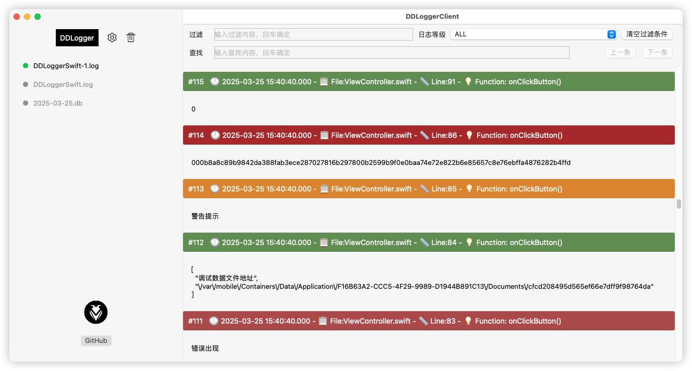

# DDLoggerSwift

   

### [中文文档](https://ddceo.com/blog/1305.html)

The iOS terminal will display the output log suspended on the screen, which can generate log file sharing, and debug information when the real machine is not connected to Xcode. You can share, filter logs and other operations. Use SQLite to store log information, support system sharing and screen FPS display


|Preview GIF picture|Xcode debug GIF|
|----|----|
|||


|preview|share & FPS|
|----|----|
|<br/>Xcode Preview<br/>||


## I. Installation

You can choose to install using cocoaPod, or you can download the source file directly into the project.

### 1.1, cocoaPod installation

```
pod 'DDLoggerSwift'
```


### 1.2, file installation

You can drag the files in the `pod` folder into the project under the project.

## II. Use

### 1、Import header file

```
Import DDLoggerSwift
```


### 2、 display the floating window

```
DDLoggerSwift.show()
```

### 3 、 Print log content

The font colors of the three output methods are different, and the corresponding types of printLog are different.

```
printDebug(log)	//the log will not be written to the window, only output in xcode

printLog(log) // Log's textColor is green

printWarn(log) // log's textColor is yellow

printError(log) // Log's textColor is red

printPrivacy(log) // Output of encrypted data, the specific encryption method is described in the following encryption
```

Output format

```
2021-08-11 10:07:28.378 ---- ⚠️⚠️ ---- File: ViewController.swift -- Line: 82 -- Function:ViewController.swift.onClickButton() ----
警告提示

2021-08-11 10:07:28.380 ---- ❌❌ ---- File: ViewController.swift -- Line: 84 -- Function:ViewController.swift.onClickButton() ----
错误出现

2021-08-11 10:07:28.381 ---- ⛔️⛔️ ---- File: ViewController.swift -- Line: 86 -- Function:ViewController.swift.onClickButton() ----
AAuKjIm5hC2jiPqz7OKHAngWspeACyWZufDguqdOcugituhWV8jnbr/6SHYoK0/9

2021-08-11 10:07:28.383 ---- ✅✅ ---- File: ViewController.swift -- Line: 89 -- Function:ViewController.swift.onClickButton() ----
{
  "77777" : "数据库的复健科花见花开会尽快圣诞节开发和金黄色的费四大皆空回复就开始和豆腐是砍价的回复斯柯达金凤凰",
  "hhhhhhh" : "撒旦法是打发斯蒂芬是打发斯蒂芬"
}

2021-08-11 10:07:28.388 ---- 💜💜 ---- File: ViewController.swift -- Line: 76 -- Function:ViewController.swift.onClickButton() ----
测试输出，默认不会写入数据库
```

## III. more settings

### 1、Set whether to output all information

```
DDLoggerSwift.isFullLogOut = true
```

If it is set to `true`, the output format is as follows, including the output file, the number of lines called, and the function name

```
2021-08-11 10:07:28.378 ---- ⚠️⚠️ ---- File: ViewController.swift -- Line: 82 -- Function:ViewController.swift.onClickButton() ----
警告提示

2021-08-11 10:07:28.380 ---- ❌❌ ---- File: ViewController.swift -- Line: 84 -- Function:ViewController.swift.onClickButton() ----
错误出现

2021-08-11 10:07:28.381 ---- ⛔️⛔️ ---- File: ViewController.swift -- Line: 86 -- Function:ViewController.swift.onClickButton() ----
AAuKjIm5hC2jiPqz7OKHAngWspeACyWZufDguqdOcugituhWV8jnbr/6SHYoK0/9

2021-08-11 10:07:28.383 ---- ✅✅ ---- File: ViewController.swift -- Line: 89 -- Function:ViewController.swift.onClickButton() ----
{
  "77777" : "数据库的复健科花见花开会尽快圣诞节开发和金黄色的费四大皆空回复就开始和豆腐是砍价的回复斯柯达金凤凰",
  "hhhhhhh" : "撒旦法是打发斯蒂芬是打发斯蒂芬"
}

2021-08-11 10:07:28.388 ---- 💜💜 ---- File: ViewController.swift -- Line: 76 -- Function:ViewController.swift.onClickButton() ----
测试输出，默认不会写入数据库
```

If it is set to `false`, the output format is as follows

```
2021-08-11 10:10:33.309 ---- ⚠️⚠️ ---- 
警告提示

2021-08-11 10:10:33.310 ---- ❌❌ ---- 
错误出现

2021-08-11 10:10:33.312 ---- ⛔️⛔️ ---- 
AAuKjIm5hC2jiPqz7OKHAngWspeACyWZufDguqdOcugituhWV8jnbr/6SHYoK0/9

2021-08-11 10:10:33.318 ---- ✅✅ ---- 
{
  "hhhhhhh" : "撒旦法是打发斯蒂芬是打发斯蒂芬",
  "77777" : "数据库的复健科花见花开会尽快圣诞节开发和金黄色的费四大皆空回复就开始和豆腐是砍价的回复斯柯达金凤凰"
}

2021-08-11 10:10:33.323 ---- 💜💜 ---- 
测试输出，默认不会写入数据库
```

### 2、 Whether to output content synchronously in the debug bar at the bottom of xcode

```
DDLoggerSwift.isSyncConsole = true
```

### 3、Separate log folder for different users

```
DDLoggerSwift.userID = "1001"
```

### 4、Clear the log

```
DDLoggerSwift.cleanLog()
```

### 5、close the entire log window

```
DDLoggerSwift.close()
```

### 6、only hide the log output window

```
DDLoggerSwift.hide()
```

### 7、set the log maximum number of records,  0 is not limited, default value is 100

```
DDLoggerSwift.maxDisplayCount = 100
```
### 8、 delete the local LogFile

```
DDLoggerSwift.deleteLogFile()
```

### 9、 The validity period of the local log file (days), the local log beyond the validity period will be deleted, 0 is no validity period, default is 30 days

```
DDLoggerSwift.logExpiryDay = 30
```

### 10、storageLevels

The included log level will be stored in the database. By default, the debug level is not stored

```

DDLoggerSwift.storageLevels = [.info, .warn, .error, .privacy]

```

### 11、Get the array of logs. You can specify the date

```
//today
DDLoggerSwift.getAllLog()

//Special date
DDLoggerSwift.getAllLog(date: Date(timeIntervalSinceNow: 1000))
```

If you want to get all the log files, you can get the folder where the log is stored, return a URL result, and then traverse to process it yourself

```
DDLoggerSwift.getDBFolder()
```

for example

```
let dbFolder = DDLoggerSwift.getDBFolder()
        
if let enumer = FileManager.default.enumerator(atPath: dbFolder.path) {
    while let file = enumer.nextObject() {
       if let file: String = file as? String {
            if file.hasSuffix(".db") {
	            //Get the specific log file log
                let logFilePath = dbFolder.appendingPathComponent(file, isDirectory: false)              
            }
        }
    }
}
```

### 12. Directly display log sharing window

If you don't want users to see the log output window, but just let them share the log, you can call

```
DDLoggerSwift.showShare()
```

### 13、Display log upload, select window and button

If you want users to upload DB files, in addition to traversing by themselves, we also provide a shortcut scheme. Like sharing, call

```
DDLoggerSwift.showUpload()
```

The upload option will appears. The callback determined after the user selects is in `uploadcomplete`. You can implement the callback, for example

```
DDLoggerSwift.uploadComplete = { file in
     print(file)
     //Process upload
}
```

### 14、 Throttling

Refreshing the interface with a large amount of output content in a short period of time can cause a large amount of CPU computation. Therefore, a throttling method can be adopted, and a timed refresh interface can be set in seconds, with a default value of 0

```
DDLoggerSwift.throttleTime = 2
```

### LogContent protocol

If you want to customize the output content, you can integrate and use this type of `LogContent` protocol. For example, you can print the `URL` type to output only its` path`. You can directly set the returned `logStringValue`.

```
extension URL: LogContent {
    public var logStringValue: String {
        return self.path
    }
}
```

## IV. sensitive information output encryption and decryption

If there is sensitive information that you don't want users to see when debugging, you can set encryption in two simple steps

```
// 1. Set the encryption password,  32 characters
DDLoggerSwift.privacyLogPassword = "12345678901234561234567890123456"

// 2, output encrypted content
printPrivacy("This is test data 222 for encrypted data")
```

### 4.2 Decrypt the contents of the display window

After the setting, the display in the display window is `This content is encrypted, please view it after decryption`, enter the set encryption password and click decrypt to display the info encrypted content.

### 4.1. Decrypting shared files

* If the data has been decrypted in the display window, the content of the shared file will not be encrypted at this time, and all content will be displayed.
* If it is not decrypted in the display window, the content of the file shared at this time is AES encrypted content, you can search the `AES Online Decryption Website` to decrypt the content, and the settings are as follows:


* Mode: CBC
* Fill: Pkcs7
* Data block: 128 bits
* Offset: `abcdefghijklmnop`
* Encoding: Base64
* Character set: UTF8
* Password: The password you set in the SDK yourself

Then click Decrypt.

Here are a few online sites recommended, you can also Google it by yourself

* [https://oktools.net/aes](https://oktools.net/aes)
* [http://tools.bugscaner.com/cryptoaes/](http://tools.bugscaner.com/cryptoaes/)
* [http://tool.chacuo.net/cryptaes](http://tool.chacuo.net/cryptaes)

## V. Log viewing client

This library uses `SQLite` to store log information. So you can use [DDLoggerSwift_Mac](https://github.com/DamonHu/DDLoggerSwift_Mac), the client of `DDLoggerSwift` cooperates to view the export SQLite data.



## local network real-time log

After the `3.0.0` version, it can be used with the above log viewing tool to realize real-time log viewing on the local area network, and use the simple configuration interface

1. Increase the local network function

````
pod 'DDLoggerSwift/socket'
````

2. Add the local network description and the service field of `Bonjour` in the project `info.plist`.

````
<key>NSBonjourServices</key>
<array>
<string>_DDLoggerSwift._tcp</string>
</array>
<key>NSLocalNetworkUsageDescription</key>
<string>Find the local network to use the Bonjour feature</string>
````

**Note: The type value of `NSBonjourServices` is consistent with `DDLoggerSwift.socketType`. The `socketType` in the DDLoggerSwift code can be customized. After modification, the `info.plist` should be modified accordingly **

No other configuration is required, you can view the device logs under the same local network by [DDLoggerSwift_Mac](https://github.com/DamonHu/DDLoggerSwift_Mac)

## Other Tips

1. For the convenience of viewing, it is divided into three types: info, warning and error. It corresponds to three different colors for easy viewing.
2. Click the corresponding cell to copy the output log directly to the system clipboard.
3. Share the system share that is called. Which software you can share depends on which software is installed on your phone.
4. The shared log file can be viewed in any text editor. When viewed in 'vscode', the code will be highlighted

## License

The project is based on the MIT License