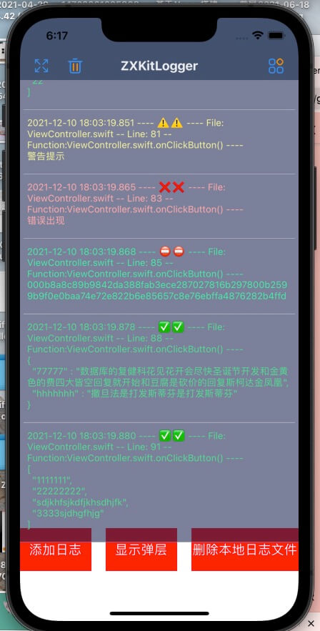

# ZXKitLogger


该项目由[HDWindowLoggerSwift](https://github.com/DamonHu/HDWindowLoggerSwift)更新升级而来，iOS端将输出日志log悬浮显示在屏幕上，可以生成日志文件分享，便于在真机没有连接xcode的情况下调试信息。可以分享、筛选log等操作。使用SQLite存储日志信息，支持系统分享和屏幕FPS显示。后续更新会增加更多的功能，而不仅限于日志输出。

调试窗口可在屏幕上显示，可以设置是否自动滚动日志便于调试，也可以将输出的日志分享到微信、twitter等程序，以便离线查看。同时可以搜索输出内容，敏感内容可以设置密码进行加密，分享出来的文件也会进行加密，可以通过密码在线解密。

该项目使用`sqlite`高效存储，后台运行期间只记录数据，不会影响界面性能，前台运行效率高，基本和Xcode同步输出日志，可以查看和xCode日志输出的对比gif图

|预览gif图|Xcode对比gif图|
|----|----|
|||


|手机预览图|XCode预览图|分享 & FPS|
|----|----|----|
||||


## 一、安装

你可以选择使用cocoaPod安装，也可以直接下载源文件拖入项目中

### 1.1、cocoaPod安装

```
pod 'ZXKitLogger'
```

#### 1.1.1、wcdb兼容

如果你集成了腾讯的[Tencent/wcdb](https://github.com/Tencent/wcdb)，由于修改优化了`sqlite`的系统功能，会导致函数名一样报错，可以使用wcdb版本

```
pod 'ZXKitLogger/wcdb'
```

### 1.2、文件安装

可以将工程底下，`pod`文件夹内的文件拖入项目即可

## 二、使用

简单三步即可调用

### 1、导入头文件

```
import ZXKitLogger
```

### 2、显示悬浮窗

```
ZXKitLogger.show()
```

### 3、打印日志内容

四种输出方式字体颜色显示不同，对应的printLog不同的类型

```
ZXDebugLog(log)	//调试输出，内容不会写入到窗口，只在xcode输出

ZXNormalLog(log)	//日志为绿色

ZXWarnLog(log)	//日志为黄色

ZXErrorLog(log)	//日志为红色

ZXPrivacyLog(log)	//加密数据的输出，具体加密方式在下面的加密中说明

```

输出格式

```
13:45:00.153  >   [
  "1111111",
  "22222222",
  "sdjkhfsjkdfjkhsdhjfk",
  "3333sjdhgfhjg"
]
```

## 三、更多设置

通过其他设置可以实现获取更多功能

### 1、设置是否输出全部信息

```
ZXKitLogger.isFullLogOut = true
```

如果设置为输出全部调试信息，那么输出的格式是下面这样的，包含了输出文件、调用的行数、和调用的函数

```
13:51:38.498  >   [File:ViewController.swift]:[Line:41:[Function:onClickButton()]]-Log:
[
  "1111111",
  "22222222",
  "sdjkhfsjkdfjkhsdhjfk",
  "3333sjdhgfhjg"
]
```

### 2、是否在xcode底部的调试栏同步输出内容

```
ZXKitLogger.isSyncConsole = true
```

### 3、针对不同用户设置独立日志文件夹

```
ZXKitLogger.userID = "1001"
```

### 4、清空log

```
ZXKitLogger.cleanLog()
```

### 5、关闭整个log窗口

```
ZXKitLogger.close()
```

### 6、仅隐藏log输出窗口

```
ZXKitLogger.hide()
```

### 7、设置显示log最大记录数，0为不限制, 默认为100

```
ZXKitLogger.maxDisplayCount = 100
```

### 8、 删除本地日志文件

```
ZXKitLogger.deleteLogFile()
```

### 9、 本地日志文件的有效期（天），超出有效期的本地日志会被删除，0为没有有效期，默认为7天

```
ZXKitLogger.logExpiryDay = 0
```

### 10、获取数据库存储的日志信息数组，也可以指定日期

```
//获取今日的日志
ZXKitLogger.getAllLog()
//指定日期
ZXKitLogger.getAllLog(date: Date(timeIntervalSinceNow: 1000))
```

如果你想获取所有日志文件，可以获取日志存储的文件夹，返回的是一个URL结果，然后自己进行遍历去处理

```
ZXKitLogger.getDBFolder()
```

例如

```
let dbFolder = ZXKitLogger.getDBFolder()
        
if let enumer = FileManager.default.enumerator(atPath: dbFolder.path) {
    while let file = enumer.nextObject() {
         if let file: String = file as? String {
            if file.hasSuffix(".db") {
            	//获取到具体的log文件日志
                let logFilePath = dbFolder.appendingPathComponent(file, isDirectory: false)
             }
         }
    }
}
```

### LogContent协议

如果你想自定义输出的内容，可以集成并该类型的LogContent协议，例如设置打印`URL`类型只输出它的`path`，可以直接设置返回的`logStringValue`即可。

```
extension URL: LogContent {
    public var logStringValue: String {
        return self.path
    }
}
```

### 支持ZXKit快捷启动

该工具支持`ZXKit`快捷启动，如果需要在ZXKit工具集中显示，可以执行该命令

```
pod 'ZXKitLogger/zxkit'
```

之后注册到`ZXKit`即可

```
ZXKitLogger.registZXKit()
```


## 四、 敏感信息输出加密和解密

如果存在敏感信息，不希望用户或者手机调试时看到，简单两步就可以设置加密

```
//1、设置加密密码，32个字符数字
ZXKitLogger.privacyLogPassword = "12345678901234561234567890123456"

//2、输出加密内容
ZXPrivacyLog("这个是加密数据的测试数据222")
```

### 4.2、显示窗内容解密

设置之后，在显示窗中的显示为`该内容已加密，请解密后查看`，输入设置的加密密码然后点击解密之后即可显示正常的加密内容。

### 4.1、 分享文件解密

* 如果已经在显示窗解密了数据，此时分享的文件内容不会加密，会显示所有内容。
* 如果在显示窗中未解密，此时分享出的文件内容为AES加密内容，可以搜索`AES在线解密的网站`去解密内容，设置参照下图：


* 模式: CBC
* 填充: Pkcs7
* 数据块: 128位
* 偏移量: abcdefghijklmnop
* 编码: Base64
* 字符集: UTF8
* 密码: 你自己在sdk中设置的密码

然后点击解密即可。

这里推荐几个在线的网站，你也可以自己百度

* [https://oktools.net/aes](https://oktools.net/aes)
* [http://tools.bugscaner.com/cryptoaes/](http://tools.bugscaner.com/cryptoaes/)
* [http://tool.chacuo.net/cryptaes](http://tool.chacuo.net/cryptaes)

## 五、其他说明

1. 为了查看方便，分为普通、警告、错误三种类型，对应了三种不同的颜色，方便查看
2. 点击对应的cell可以直接将输出log复制到系统剪贴板
3. 分享调用的系统分享，可以分享到哪个软件取决于你手机上安装的有哪些软件。

## License协议


该项目使用Apache-2.0许可证，Copyright 2021 ZXKit和所有贡献者